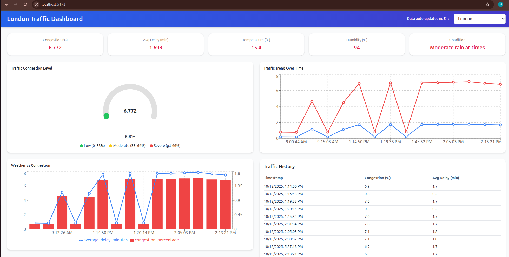
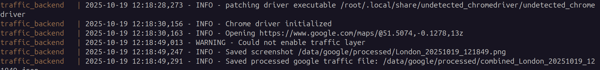

# 🚦 Traffic Analytics System

A full-stack **Traffic Analytics Dashboard** that visualizes **real-time Google Maps congestion data** and correlates it with **current weather** using FastAPI, React, PostgreSQL, and Docker.

---

## 🏗️ Architecture Overview

### Components
| Layer | Description |
|-------|--------------|
| **Frontend (React + Vite)** | Interactive dashboard showing traffic congestion trends, weather correlation, and city-level summaries. |
| **Backend (FastAPI)** | Provides REST APIs for traffic data refresh, historical data retrieval, and weather correlation analytics. |
| **ETL Scripts (Python)** | Extracts live data from Google Maps (via headless Chrome) and WeatherAPI, processes it, and loads it into PostgreSQL. |
| **Database (PostgreSQL)** | Stores normalized and historical traffic/weather data for time-based trend analysis. |
| **Containerization (Docker Compose)** | Orchestrates backend, frontend, and PostgreSQL in isolated containers for easy deployment. |

---

## 🧠 System Flow

1. **Traffic Data Extraction**
   - The `google_traffic_extract.py` script uses `undetected_chromedriver` to take a **Google Maps screenshot**.
   - Analyzes red/yellow/green road pixels via OpenCV to calculate a **congestion score**.

2. **Weather Data Extraction**
   - The `weather_extract.py` script uses the [WeatherAPI Free Tier](https://www.weatherapi.com/) to fetch current weather based on coordinates.
   - Note: My free trial key is valid till **October 31st, 2025**.

3. **ETL & Storage**
   - Processed data is normalized and loaded into PostgreSQL tables:  
     - `etl_runs`  
     - `google_traffic_data`  
     - `weather_data`

4. **Dashboard Visualization**
   - The React dashboard fetches processed data through `/api/traffic/*` endpoints and renders:
     - **Traffic Trend Line**
     - **Weather Correlation Scatterplot**
     - **Summary Cards (average delay, congestion, etc.)**

---

## 🐳 Setup Instructions

### 🧩 Option 1 — Run with Docker
Make sure you have **Docker** and **Docker Compose** installed.

```bash
# Clone the repository
git clone https://github.com/<your-username>/traffic-analytics-system.git
cd traffic-analytics-system

# Build and start all services
docker compose up --build

Then open:

Frontend: http://localhost:5173
Backend (FastAPI docs): http://localhost:8000/docs


You can trigger a refresh for any city:

POST http://localhost:8000/api/data/refresh?city=London&lat=51.5074&lon=-0.1278
```

### 🧠 Option 2 — Run Locally on a Debian (Without Docker)

**Prerequisites**

1. Python 3.11+

2. Node.js 18+

3. PostgreSQL 15+

**Backend Setup**

```bash
cd backend
python -m venv venv
source venv/bin/activate
pip install -r requirements.txt

export DB_HOST=localhost
export DB_PORT=5432
export DB_NAME=trafficdb
export DB_USER=postgres
export DB_PASS=postgres
export WEATHER_API_KEY=your_api_key

uvicorn app.main:app --reload
```
> Note:  The Weather API key is hardcoded for convenience but in a real project should be handled via environment variable.

### Swagger UI - API Documentation
`http://localhost:8000/docs` or [openapi.json](openapi.json)

**Frontend Setup**
```bash
cd frontend
npm install
npm run dev
```

## ⚙️ Key Design Decisions
| Decision                                          | Reason                                                                                                |
| ------------------------------------------------- | ----------------------------------------------------------------------------------------------------- |
| Used **undetected-chromedriver**                  | Bypasses bot detection and allows Google Maps to load the full traffic layer.                         |
| Used **WeatherAPI** instead of OpenWeather        | OpenWeather free tier limited calls and rate-throttled quickly. WeatherAPI offers stable free access. |
| Used **Docker Compose** for combined deployment   | Easier orchestration between FastAPI, Postgres, and React.                                            |
| Used **Headless Chrome**                          | Enables running traffic extraction inside Docker without GUI/X server.                                |

## 🚧 Challenges Faced & Solutions
| # | Challenge                                 | Root Cause                                                                  | Solution                                                                                           |
| - | ----------------------------------------- | --------------------------------------------------------------------------- | -------------------------------------------------------------------------------------------------- |
| 1 | **Waze API Access Failure**               | Waze stopped exposing free traffic APIs and rate-limited web requests.      | Switched to Google Maps traffic layer with visual extraction via Selenium + OpenCV.                |
| 2 | **OpenWeather API quota**                 | The free plan allowed only 60 calls/min and often returned incomplete data. | Migrated to [WeatherAPI](https://www.weatherapi.com/) free tier (valid till **31 Oct 2025**).      |
| 3 | **`distutils` missing inside Docker**     | Newer Python builds removed `distutils` by default.                         | Installed `python3-distutils` in Dockerfile and upgraded pip/setuptools/wheel.                     |
| 4 | **Chrome not launching in Docker**        | GUI mode doesn’t work inside containers.                                    | Switched to `headless` Chrome mode with correct flags (`--no-sandbox`, `--disable-dev-shm-usage`). |
| 5 | **Database connection refused**           | `localhost` doesn’t resolve inside container network.                       | Updated connection host to `db` (service name in Docker Compose).                                  |
| 6 | **Null timestamps in history**            | ETL wasn’t inserting `run_timestamp` explicitly.                            | Modified loader to always use `NOW()` for timestamps.                                              |
| 7 | **Auto-refresh instability on charts**    | React chart rerender loop triggered by polling.                             | Adjusted trend line logic to hold state between refreshes and redraw only on reload.               |
| 8 | **Accumulation of old screenshots/JSONs** | Continuous extraction kept adding new files.                                | Added cleanup utility in `src/utils/logger.py` to delete all but the latest JSON/PNG.              |

## 🧾 Sample Output
`data/sample_traffic_data.json`
```json
{
  "extraction_timestamp": "2025-10-19T11:53:35Z",
  "city": "London",
  "lat": 51.5074,
  "lon": -0.1278,
  "results": [
    {
      "route_name": "London - view",
      "timestamp": "2025-10-19T11:53:35Z",
      "location": "51.5074,-0.1278",
      "congestion_percentage": 0.71,
      "average_delay_minutes": 0.18,
      "traffic_level": "Light",
      "color_breakdown": {
        "red": 0.28,
        "yellow": 0.42,
        "green": 0.30
      },
      "extraction_method": "visual_analysis",
      "screenshot_path": "/data/google/processed/combined_London_20251019_115335.png"
    }
  ]
}
```

## Screenshots



## Explanation of the extraction

**Attempted to create a smart system that "looks at" Google Maps traffic colors like a human would, and turns those colors into useful numbers.**

Instead of trying to hack Google's systems, the code  simply:

1. **Open Google Maps** in a special browser that doesn't look like a robot
2. **Take a screenshot** of the traffic overlay (the red/yellow/green roads)
3. **Analyze the colors** in the picture to count how much is red vs yellow vs green
4. **Convert colors to traffic metrics** - more red = more congestion, more delays
5. **Save the results** as structured data that our dashboard can use

**Think of it as:** Teaching a computer to "see" traffic jams by looking at map colors, just like you do when you check Google Maps before driving somewhere!

## Limitations of the extraction

While the extraction process generally performs successfully, there are certain cases where Google Maps does not automatically enable the traffic layer when opened programmatically. In these instances, the script requires a manual click on the "Traffic" option to display live congestion data before it can be captured accurately.

This limitation becomes more pronounced in Dockerized or headless environments, where no interactive browser interface is available. As a result, the code may fail to activate the traffic overlay automatically, leading to incomplete or less accurate congestion analysis, as evidenced in the Docker logs below.



## TODO
- Write Unit Test cases for all the services using pytest or Tox
- Work on improving the accuracy of headless docker setup
